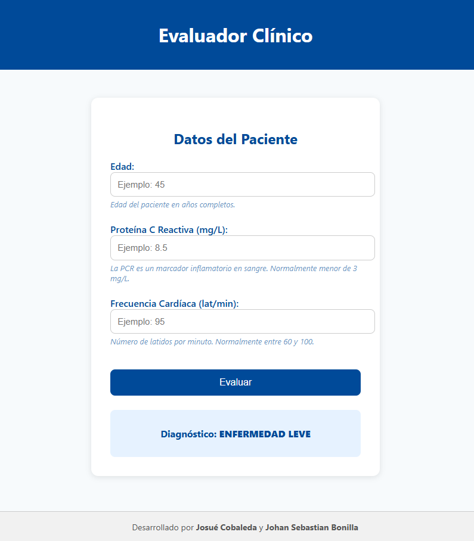

# Servicio de Predicción Clínica (Simulado) - Docker + Flask

## Descripción general
Este proyecto implementa un **servicio web médico simulado** que permite a un profesional ingresar variables clínicas básicas y obtener una predicción del estado de salud del paciente.

El sistema **no usa un modelo de machine learning real**, sino reglas determinísticas que simulan el comportamiento de un modelo predictivo.  
El propósito es **demostrar cómo desplegar un modelo o servicio de predicción dentro de un contenedor Docker**, exponiéndolo mediante una interfaz web o una API.


## Estados posibles
El servicio retorna uno de los siguientes estados clínicos:

- 🟢 **NO ENFERMO**  
- 🟡 **ENFERMEDAD LEVE**  
- 🟠 **ENFERMEDAD AGUDA**  
- 🔴 **ENFERMEDAD CRÓNICA**
- ⚫ **ENFERMEDAD TERMINAL**


---

## Estructura del proyecto


```text
servicio_medico/
│
├── app.py           # Aplicación web: levanta el servidor Flask, recibe datos del usuario y muestra resultados.
├── requirements.txt # Dependencias de Python necesarias (Flask, etc.).
├── Dockerfile       # Define la imagen Docker del servicio para correr la app en cualquier máquina.
├── templates/
│   ├── index.html        # Página principal (formulario)
│   └── historial.html    # Página de historial de predicciones
├── logs/
│   └── predicciones.csv  # Archivo donde se guardan las predicciones
└── README.md        # Documentación del proyecto, instrucciones de uso, ejemplos y créditos.
```


---

## Ejecución con Docker

Sigue estos pasos para levantar la aplicación en tu computadora:

### 1. Construir la imagen

Desde la carpeta raíz del proyecto (donde está el `Dockerfile`), ejecuta este comando en la terminal:

```bash
docker build -t servicio_medico:1.0 .
```

Esto crea una imagen de Docker que contiene toda la aplicación y sus dependencias.


### 2. Ejecutar el contenedor

Una vez construida la imagen, ejecuta:

```bash
docker run --rm -p 5000:5000 servicio_medico:1.0
```

### 3. Acceder a la aplicación

Abre tu navegador web y escribe:

http://localhost:5000

Allí podrás ingresar los valores requeridos (edad, PCR, frecuencia cardíaca) y obtener el diagnóstico correspondiente.

### 4. Detener la aplicación

Para cerrar la app, presiona Ctrl + C en la terminal donde la ejecutaste.

Esto detiene el contenedor y libera el puerto 5000.

---

## Ejemplo de uso


| Variable                      | Descripción                  | Ejemplo |
| ----------------------------- | ---------------------------- | ------- |
| **Edad**                      | Años completos del paciente  | `45`    |
| **Proteína C Reactiva (PCR)** | Marcador inflamatorio (mg/L) | `8.5`   |
| **Frecuencia Cardíaca (FC)**  | Latidos por minuto           | `95`    |


Resultado esperado → ENFERMEDAD LEVE


---

## Consultar resultados previos

Cada predicción se almacena automáticamente en un archivo CSV (logs/predicciones.csv).

Puedes consultar los registros de dos maneras:


### 1. Desde la página principal

En la interfaz donde realizas las predicciones hay un botón “Consultar predicciones”, que te lleva directamente a la vista con todas las estadísticas y predicciones recientes.

Ideal para los médicos que usan la app de forma visual.


### 2. Accediendo directamente desde el navegador


Accede a:

http://localhost:5000/historial

Esto crea una imagen de Docker que contiene toda la aplicación y sus dependencias.


Allí se muestra:

- Número total de predicciones por categoría.
- Últimas 5 predicciones realizadas.
- Fecha del último registro.

---

## Interfaz Web

La aplicación incluye una interfaz médica limpia desarrollada con HTML y CSS:

Campos de entrada con descripciones y ejemplos.

Diagnóstico mostrado de forma clara y visual.



---

## Tecnologías usadas

* 🐍 Python 3.10

* 🌶 Flask (microframework web)

* 🧱 HTML5 / CSS3

* 🐳 Docker

---

## Autores

* Josué Cobaleda

* Johan Sebastian Bonilla

---

Este proyecto es demostrativo y no debe utilizarse para diagnósticos médicos reales.